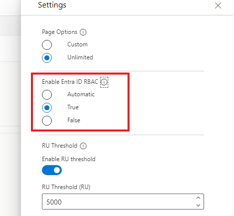

# Azure Cosmos DB Data Plane Role-Based Access Control (NoSQL API)

Azure Cosmos DB offers built-in Azure role-based access control (Azure RBAC) for managing Azure Cosmos DB. In addition to the pre-defined roles, users have the ability to create custom roles in Azure and assign them to service principals across all subscriptions within their Active Directory tenant.

When creating a custom role, you can define the specific permissions that the role should have. These permissions are specified using a set of actions that are specific to Azure Cosmos DB. List of actions for management plan operations are available here - [Microsoft DocumentDB Permissions](https://learn.microsoft.com/en-us/azure/role-based-access-control/permissions/databases#microsoftdocumentdb)

Additionally Azure Cosmos DB exposes a built-in RBAC system that lets you enable RBAC for data plane operations. This allows you to:

- Authenticate your data requests with a Microsoft Entra identity.
- Authorize your data requests with a fine-grained, role-based permission model.

List of actions exposed by the permission model for database operations are available here - [Configure role-based access control to data](https://learn.microsoft.com/en-us/azure/cosmos-db/how-to-setup-rbac)

Read Database and Read Container are considered metadata requests. Access to these operations can be granted using the following actions: ```Microsoft.DocumentDB/databaseAccounts/readMetadata```

## Create a custom role

Azure Cosmos DB exposes two built-in role definitions:

| Name | Included actions |
|---|---|
| Cosmos DB Built-in Data Reader | `Microsoft.DocumentDB/databaseAccounts/readMetadata`<br />`Microsoft.DocumentDB/databaseAccounts/sqlDatabases/containers/items/read`<br />`Microsoft.DocumentDB/databaseAccounts/sqlDatabases/containers/executeQuery`<br />`Microsoft.DocumentDB/databaseAccounts/sqlDatabases/containers/readChangeFeed` |
| Cosmos DB Built-in Data Contributor | `Microsoft.DocumentDB/databaseAccounts/readMetadata`<br />`Microsoft.DocumentDB/databaseAccounts/sqlDatabases/containers/*`<br />`Microsoft.DocumentDB/databaseAccounts/sqlDatabases/containers/items/*` |

Use the following command, to fetch all the built-in roles available for Azure Cosmos DB:

```powershell
Get-AzCosmosDBSqlRoleDefinition -AccountName $accountName -ResourceGroupName $resourceGroupName
```

If not available, you can create a custom role in the Azure portal. To create a custom role, follow these steps:

1. The operations mentioned above are currently available only in Azure PowerShell and Azure CLI.
2. Using PowerShell, you can create a custom role using the following command:

    ```powershell
    $resourceGroupName = "<myResourceGroup>"
    $accountName = "<myCosmosAccount>"

    New-AzCosmosDBSqlRoleDefinition -AccountName $accountName `
        -ResourceGroupName $resourceGroupName `
        -Type CustomRole -RoleName "Cosmos DB Data Contributor" `
        -DataAction @( `
            'Microsoft.DocumentDB/databaseAccounts/readMetadata', `
            'Microsoft.DocumentDB/databaseAccounts/sqlDatabases/containers/items/*', `
            'Microsoft.DocumentDB/databaseAccounts/sqlDatabases/containers/*') `
            -AssignableScope "/"
    ```

3. Create a new role assignment, for the custom role, using the following command:

    ```powershell
    $resourceGroupName = "<myResourceGroup>"
    $accountName = "<myCosmosAccount>"
    $readOnlyRoleDefinitionId = "<roleDefinitionId>" # ID of the built-in role definition or a custom role definition created
    $principalId = "<aadPrincipalId>" # ID of the AAD principal to assign the role to

    New-AzCosmosDBSqlRoleAssignment -AccountName $accountName `
        -ResourceGroupName $resourceGroupName `
        -RoleDefinitionId $readOnlyRoleDefinitionId `
        -Scope "/" `
        -PrincipalId $principalId
    ```

4. Validate the role assignment using the following command.

    ```powershell
    $resourceGroupName = "<myResourceGroup>"
    $accountName = "<myCosmosAccount>"

    Get-AzCosmosDBSqlRoleAssignment -ResourceGroupName $resourceGroupName -AccountName $accountName
    ```

5. From [Cosmos DB Explorer](https://cosmos.azure.com/), update the settings to enable Entra ID RBAC.

    

6. Once the RBAC is enabled, you can authenticate your data requests with a Microsoft Entra identity and authorize your data requests with a fine-grained, role-based permission model.